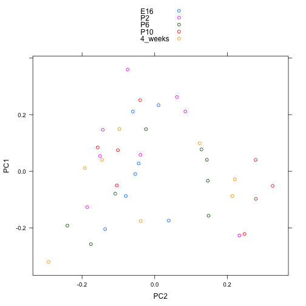

Seminar 09
========================================================


```r
library(RColorBrewer)
library(cluster)
library(pvclust)
library(xtable)
library(limma)
library(plyr)
library(lattice)

prDat <- read.table("../data/GSE4051_data.tsv", header = TRUE, row.names = 1)  # the whole enchilada
str(prDat, max.level = 0)
```

```
## 'data.frame':	29949 obs. of  39 variables:
```

```r
prDes <- readRDS("../data/GSE4051_design.rds")
str(prDes)
```

```
## 'data.frame':	39 obs. of  4 variables:
##  $ sidChar : chr  "Sample_20" "Sample_21" "Sample_22" "Sample_23" ...
##  $ sidNum  : num  20 21 22 23 16 17 6 24 25 26 ...
##  $ devStage: Factor w/ 5 levels "E16","P2","P6",..: 1 1 1 1 1 1 1 2 2 2 ...
##  $ gType   : Factor w/ 2 levels "wt","NrlKO": 1 1 1 1 2 2 2 1 1 1 ...
```

```r

sprDat <- t(scale(t(prDat)))
str(sprDat, max.level = 0, give.attr = FALSE)
```

```
##  num [1:29949, 1:39] 0.0838 0.1758 0.7797 -0.3196 0.8358 ...
```

```r

round(data.frame(avgBefore = rowMeans(head(prDat)), avgAfter = rowMeans(head(sprDat)), 
    varBefore = apply(head(prDat), 1, var), varAfter = apply(head(sprDat), 1, 
        var)), 2)
```

```
##              avgBefore avgAfter varBefore varAfter
## 1415670_at        7.22        0      0.02        1
## 1415671_at        9.37        0      0.35        1
## 1415672_at        9.70        0      0.15        1
## 1415673_at        8.42        0      0.03        1
## 1415674_a_at      8.47        0      0.02        1
## 1415675_at        9.67        0      0.03        1
```

```r

########################## Sample clustering

########################## Heirarchical

pr.dis <- dist(t(sprDat), method = "euclidean")

prDes$grp <- with(prDes, interaction(gType, devStage))
summary(prDes$grp)
```

```
##        wt.E16     NrlKO.E16         wt.P2      NrlKO.P2         wt.P6 
##             4             3             4             4             4 
##      NrlKO.P6        wt.P10     NrlKO.P10    wt.4_weeks NrlKO.4_weeks 
##             4             4             4             4             4
```

```r

pr.hc.s <- hclust(pr.dis, method = "single")
pr.hc.c <- hclust(pr.dis, method = "complete")
pr.hc.a <- hclust(pr.dis, method = "average")
pr.hc.w <- hclust(pr.dis, method = "ward")

op <- par(mar = c(0, 4, 4, 2), mfrow = c(2, 2))

plot(pr.hc.s, labels = FALSE, main = "Single", xlab = "")
plot(pr.hc.c, labels = FALSE, main = "Complete", xlab = "")
plot(pr.hc.a, labels = FALSE, main = "Average", xlab = "")
plot(pr.hc.w, labels = FALSE, main = "Ward", xlab = "")
```

 

```r

par(op)

op <- par(mar = c(1, 4, 4, 1))
plot(pr.hc.w, labels = prDes$grp, cex = 0.6, main = "Ward showing 10 clusters")
rect.hclust(pr.hc.w, k = 10)
```

 

```r

par(op)

jGraysFun <- colorRampPalette(brewer.pal(n = 9, "Greys"))
gTypeCols <- brewer.pal(11, "RdGy")[c(4, 7)]
heatmap(as.matrix(sprDat), Rowv = NA, col = jGraysFun(256), hclustfun = function(x) hclust(x, 
    method = "ward"), scale = "none", labCol = prDes$grp, labRow = NA, margins = c(8, 
    1), ColSideColor = gTypeCols[unclass(prDes$gType)])
legend("topright", legend = levels(prDes$gType), col = gTypeCols, lty = 1, lwd = 5, 
    cex = 0.5)
```

 

```r

########################## Exercise

# Trying a different method
heatmap(as.matrix(sprDat), Rowv = NA, col = jGraysFun(256), hclustfun = function(x) hclust(x, 
    method = "complete"), scale = "none", labCol = prDes$grp, labRow = NA, margins = c(8, 
    1), ColSideColor = gTypeCols[unclass(prDes$gType)])
```

 

```r

# Clustering the original data
heatmap(as.matrix(prDat), Rowv = NA, col = jGraysFun(256), hclustfun = function(x) hclust(x, 
    method = "average"), scale = "none", labCol = prDes$grp, labRow = NA, margins = c(8, 
    1), ColSideColor = gTypeCols[unclass(prDes$gType)])
```

 

```r

########################## Partitioning

set.seed(31)
k <- 5
pr.km <- kmeans(t(sprDat), centers = k, nstart = 50)

pr.km$withinss
```

```
## [1] 120153  78227 110209 100197 133036
```

```r

pr.kmTable <- data.frame(devStage = prDes$devStage, cluster = pr.km$cluster)
prTable <- xtable(with(pr.kmTable, table(devStage, cluster)), caption = "Number of samples from each develomental stage within each k-means cluster")

align(prTable) <- "lccccc"
```


```r
print(prTable, type = "html", caption.placement = "top")
```

<!-- html table generated in R 3.0.2 by xtable 1.7-3 package -->
<!-- Sun Mar 16 20:12:17 2014 -->
<TABLE border=1>
<CAPTION ALIGN="top"> Number of samples from each develomental stage within each k-means cluster </CAPTION>
<TR> <TH>  </TH> <TH> 1 </TH> <TH> 2 </TH> <TH> 3 </TH> <TH> 4 </TH> <TH> 5 </TH>  </TR>
  <TR> <TD> E16 </TD> <TD align="center">   0 </TD> <TD align="center">   0 </TD> <TD align="center">   6 </TD> <TD align="center">   0 </TD> <TD align="center">   1 </TD> </TR>
  <TR> <TD> P2 </TD> <TD align="center">   4 </TD> <TD align="center">   0 </TD> <TD align="center">   0 </TD> <TD align="center">   0 </TD> <TD align="center">   4 </TD> </TR>
  <TR> <TD> P6 </TD> <TD align="center">   5 </TD> <TD align="center">   1 </TD> <TD align="center">   0 </TD> <TD align="center">   0 </TD> <TD align="center">   2 </TD> </TR>
  <TR> <TD> P10 </TD> <TD align="center">   1 </TD> <TD align="center">   2 </TD> <TD align="center">   0 </TD> <TD align="center">   3 </TD> <TD align="center">   2 </TD> </TR>
  <TR> <TD> 4_weeks </TD> <TD align="center">   0 </TD> <TD align="center">   2 </TD> <TD align="center">   1 </TD> <TD align="center">   5 </TD> <TD align="center">   0 </TD> </TR>
   </TABLE>


```r
########################## Repeat the analysis using a different seed and check if you get the same
########################## clusters.

set.seed(15)
k <- 5
pr.km <- kmeans(t(sprDat), centers = k, nstart = 50)

pr.km$withinss
```

```
## [1]  78227 100197 133036 110209 120153
```

```r

pr.kmTable <- data.frame(devStage = prDes$devStage, cluster = pr.km$cluster)
prTable <- xtable(with(pr.kmTable, table(devStage, cluster)), caption = "Number of samples from each develomental stage within each k-means cluster")

align(prTable) <- "lccccc"
```


```r
print(prTable, type = "html", caption.placement = "top")
```

<!-- html table generated in R 3.0.2 by xtable 1.7-3 package -->
<!-- Sun Mar 16 20:12:28 2014 -->
<TABLE border=1>
<CAPTION ALIGN="top"> Number of samples from each develomental stage within each k-means cluster </CAPTION>
<TR> <TH>  </TH> <TH> 1 </TH> <TH> 2 </TH> <TH> 3 </TH> <TH> 4 </TH> <TH> 5 </TH>  </TR>
  <TR> <TD> E16 </TD> <TD align="center">   0 </TD> <TD align="center">   0 </TD> <TD align="center">   1 </TD> <TD align="center">   6 </TD> <TD align="center">   0 </TD> </TR>
  <TR> <TD> P2 </TD> <TD align="center">   0 </TD> <TD align="center">   0 </TD> <TD align="center">   4 </TD> <TD align="center">   0 </TD> <TD align="center">   4 </TD> </TR>
  <TR> <TD> P6 </TD> <TD align="center">   1 </TD> <TD align="center">   0 </TD> <TD align="center">   2 </TD> <TD align="center">   0 </TD> <TD align="center">   5 </TD> </TR>
  <TR> <TD> P10 </TD> <TD align="center">   2 </TD> <TD align="center">   3 </TD> <TD align="center">   2 </TD> <TD align="center">   0 </TD> <TD align="center">   1 </TD> </TR>
  <TR> <TD> 4_weeks </TD> <TD align="center">   2 </TD> <TD align="center">   5 </TD> <TD align="center">   0 </TD> <TD align="center">   1 </TD> <TD align="center">   0 </TD> </TR>
   </TABLE>


```r
########################## Pam

pr.pam <- pam(pr.dis, k = k)
pr.pamTable <- data.frame(devStage = prDes$devStage, cluster = pr.pam$clustering)
pamTable <- xtable(with(pr.pamTable, table(devStage, cluster)), caption = "Number of samples from each develomental stage within each PAM cluster")

align(pamTable) <- "lccccc"
```


```r
print(pamTable, type = "html", caption.placement = "top")
```

```
## <!-- html table generated in R 3.0.2 by xtable 1.7-3 package -->
## <!-- Sun Mar 16 20:12:28 2014 -->
## <TABLE border=1>
## <CAPTION ALIGN="top"> Number of samples from each develomental stage within each PAM cluster </CAPTION>
## <TR> <TH>  </TH> <TH> 1 </TH> <TH> 2 </TH> <TH> 3 </TH> <TH> 4 </TH> <TH> 5 </TH>  </TR>
##   <TR> <TD> E16 </TD> <TD align="center">   6 </TD> <TD align="center">   1 </TD> <TD align="center">   0 </TD> <TD align="center">   0 </TD> <TD align="center">   0 </TD> </TR>
##   <TR> <TD> P2 </TD> <TD align="center">   0 </TD> <TD align="center">   1 </TD> <TD align="center">   7 </TD> <TD align="center">   0 </TD> <TD align="center">   0 </TD> </TR>
##   <TR> <TD> P6 </TD> <TD align="center">   3 </TD> <TD align="center">   2 </TD> <TD align="center">   3 </TD> <TD align="center">   0 </TD> <TD align="center">   0 </TD> </TR>
##   <TR> <TD> P10 </TD> <TD align="center">   0 </TD> <TD align="center">   2 </TD> <TD align="center">   1 </TD> <TD align="center">   1 </TD> <TD align="center">   4 </TD> </TR>
##   <TR> <TD> 4_weeks </TD> <TD align="center">   1 </TD> <TD align="center">   0 </TD> <TD align="center">   1 </TD> <TD align="center">   4 </TD> <TD align="center">   2 </TD> </TR>
##    </TABLE>
```


```r
op <- par(mar = c(5, 1, 4, 4))
plot(pr.pam, main = "Silhouette Plot for 5 clusters")
```

 

```r

par(op)

########################## Exercise
k = 1:5
plot(k, pr.pam$silinfo$clus.avg.widths)
```

 

```r

########################## Gene clustering

desMat <- model.matrix(~devStage, prDes)
prFit <- lmFit(prDat, desMat)
ebFit <- eBayes(prFit)

hits <- topTable(ebFit, coef = grep("devStage", colnames(coef(ebFit))), p.value = 1e-05, 
    number = 972)

topDat <- sprDat[rownames(hits), ]

geneC.dis <- dist(topDat, method = "euclidean")

geneC.hc.a <- hclust(geneC.dis, method = "average")

plot(geneC.hc.a, labels = FALSE, main = "Hierarchical with Average Linkage", 
    xlab = "")
```

 

```r

########################## Partitioning

set.seed(1234)
k <- 5
kmeans.genes <- kmeans(topDat, centers = k)

clusterNum <- 1

plot(kmeans.genes$centers[clusterNum, ], ylim = c(-4, 4), type = "n", xlab = "Samples", 
    ylab = "Relative expression")

matlines(y = t(topDat[kmeans.genes$cluster == clusterNum, ]), col = "grey")

points(kmeans.genes$centers[clusterNum, ], type = "l")

points(kmeans.genes$centers[clusterNum, ], col = prDes$devStage, pch = 20)
```

 

```r

devStageCols <- brewer.pal(11, "RdGy")[c(2, 4, 7, 9, 11)]
heatmap(as.matrix(topDat), col = jGraysFun(256), hclustfun = function(x) hclust(x, 
    method = "average"), labCol = prDes$grp, labRow = NA, margin = c(8, 1), 
    scale = "none", ColSideColor = devStageCols[unclass(prDes$devStage)])
legend("topleft", levels(prDes$devStage), col = devStageCols, lty = 1, lwd = 5, 
    cex = 0.5)
```

 

```r

annoTopDat <- stack(as.data.frame(topDat))  # stack probe data tall and skinny
annoTopDat$probeset <- rownames(topDat)  # add probeset ID as variable
## get info on gType and devStage, then average over reps within devStage
annoTopDat <- merge(annoTopDat, prDes, by.x = "ind", by.y = "sidChar")
devStageAvg <- ddply(annoTopDat, ~probeset, function(x) {
    avgByDevStage <- aggregate(values ~ devStage, x, mean)$values
    names(avgByDevStage) <- levels(x$devStage)
    avgByDevStage
})
## put probset info back into rownames
rownames(devStageAvg) <- devStageAvg$probeset
devStageAvg$probeset <- NULL
str(devStageAvg)
```

```
## 'data.frame':	972 obs. of  5 variables:
##  $ E16    : num  -0.628 1.235 -0.419 1.401 0.855 ...
##  $ P2     : num  -1.041 0.7 -0.918 0.737 0.74 ...
##  $ P6     : num  -0.214 -0.26 -0.744 -0.66 0.34 ...
##  $ P10    : num  0.722 -0.683 0.553 -0.779 -0.363 ...
##  $ 4_weeks: num  1.083 -0.838 1.475 -0.523 -1.464 ...
```

```r

heatmap(as.matrix(devStageAvg), Colv = NA, col = jGraysFun(256), hclustfun = function(x) hclust(x, 
    method = "average"), labCol = colnames(devStageAvg), labRow = NA, margin = c(8, 
    1))
```

 

```r

k <- 4
geneDS.km <- kmeans(devStageAvg, centers = k, nstart = 50)
clust.centers <- geneDS.km$centers

# Look at all clusters
op <- par(mfrow = c(2, 2))
for (clusterNum in 1:4) {
    # Set up the axes without plotting; ylim set based on trial run.
    plot(clust.centers[clusterNum, ], ylim = c(-4, 4), type = "n", xlab = "Develomental Stage", 
        ylab = "Relative expression", axes = F, main = paste("Cluster", clusterNum, 
            sep = " "))
    axis(2)
    axis(1, 1:5, c(colnames(clust.centers)[1:4], "4W"), cex.axis = 0.9)
    
    # Plot the expression of all the genes in the selected cluster in grey.
    matlines(y = t(devStageAvg[geneDS.km$cluster == clusterNum, ]), col = "grey")
    
    # Add the cluster center. This is last so it isn't underneath the members
    points(clust.centers[clusterNum, ], type = "l")
    
    # Optional: points to show development stages.
    points(clust.centers[clusterNum, ], pch = 20)
}
```

 

```r

par(op)

plot(clust.centers[clusterNum, ], ylim = c(-4, 4), type = "n", xlab = "Develomental Stage", 
    ylab = "Average expression", axes = FALSE, main = "Clusters centers")
axis(2)
axis(1, 1:5, c(colnames(clust.centers)[1:4], "4W"), cex.axis = 0.9)

for (clusterNum in 1:4) {
    points(clust.centers[clusterNum, ], type = "l", col = clusterNum, lwd = 2)
    points(clust.centers[clusterNum, ], col = clusterNum, pch = 20)
}
```

 

```r

cloud(devStageAvg[, "E16"] ~ devStageAvg[, "P6"] * devStageAvg[, "4_weeks"], 
    col = geneDS.km$clust, xlab = "E16", ylab = "P6", zlab = "4_weeks")
```

 

```r

pvc <- pvclust(topDat, nboot = 100)
```

```
## Bootstrap (r = 0.5)... Done.
## Bootstrap (r = 0.6)... Done.
## Bootstrap (r = 0.7)... Done.
## Bootstrap (r = 0.8)... Done.
## Bootstrap (r = 0.9)... Done.
## Bootstrap (r = 1.0)... Done.
## Bootstrap (r = 1.1)... Done.
## Bootstrap (r = 1.2)... Done.
## Bootstrap (r = 1.3)... Done.
## Bootstrap (r = 1.4)... Done.
```

```r

plot(pvc, labels = prDes$grp, cex = 0.6)
pvrect(pvc, alpha = 0.95)
```

 

```r

########################## PCA
pcs <- prcomp(sprDat, center = F, scale = F)

# scree plot
plot(pcs)
```

 

```r

# append the rotations for the first 10 PCs to the phenodata
prinComp <- cbind(prDes, pcs$rotation[prDes$sidNum, 1:10])

# scatter plot showing us how the first few PCs relate to covariates
plot(prinComp[, c("sidNum", "devStage", "gType", "PC1", "PC2", "PC3")], pch = 19, 
    cex = 0.8)
```

 

```r

plot(prinComp[, c("PC1", "PC2")], bg = prDes$devStage, pch = 21, cex = 1.5)
legend(list(x = 0.2, y = 0.3), as.character(levels(prDes$devStage)), pch = 21, 
    pt.bg = c(1, 2, 3, 4, 5))
```

 

```r

######################## Exercise

# one plot in lattice
xyplot(PC1 ~ PC2, prinComp, groups = devStage, auto.key = TRUE)
```

 


